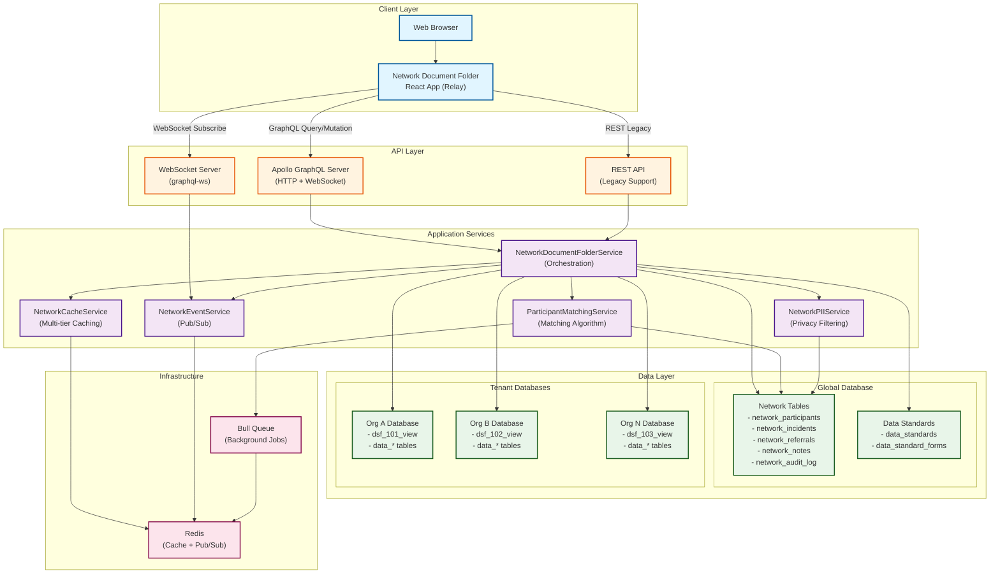
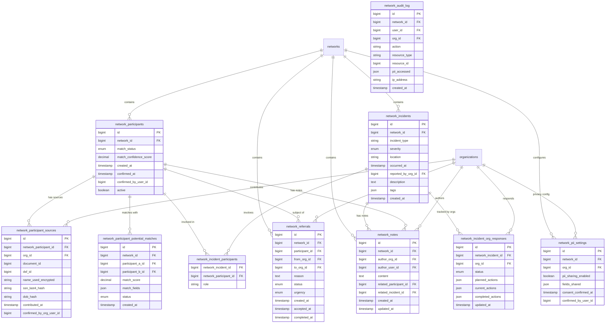
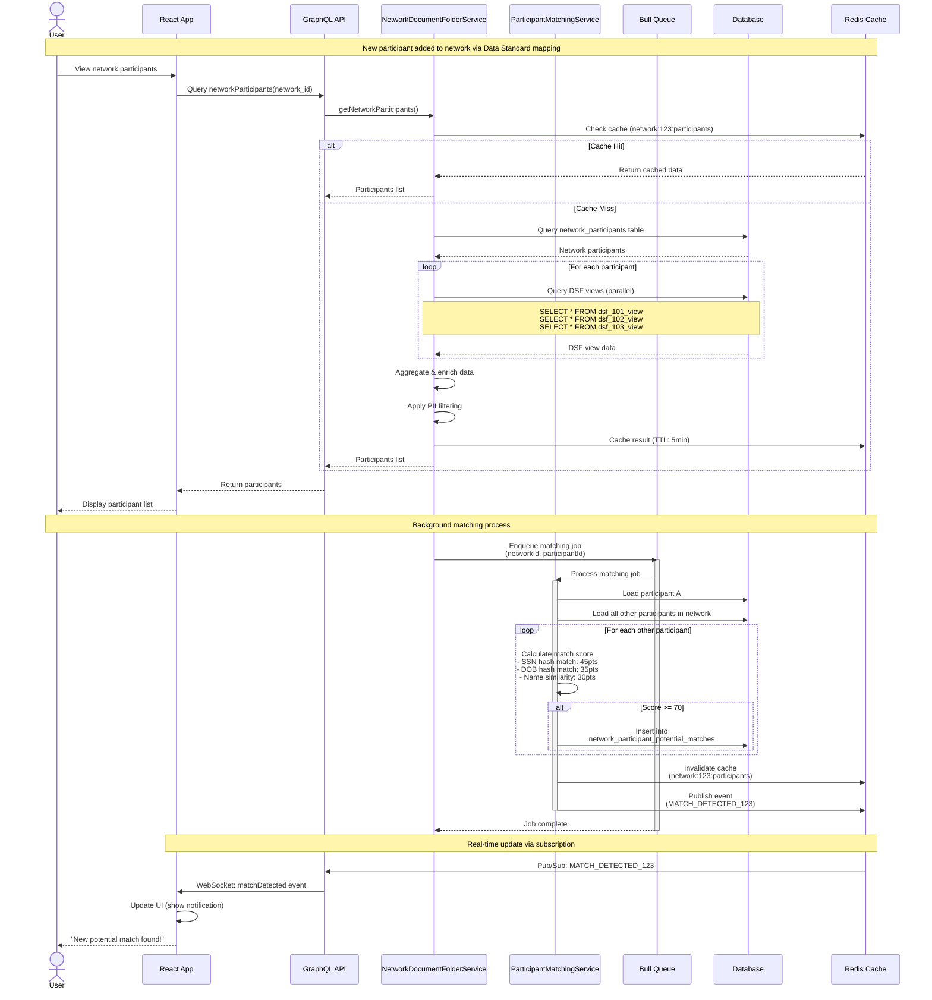
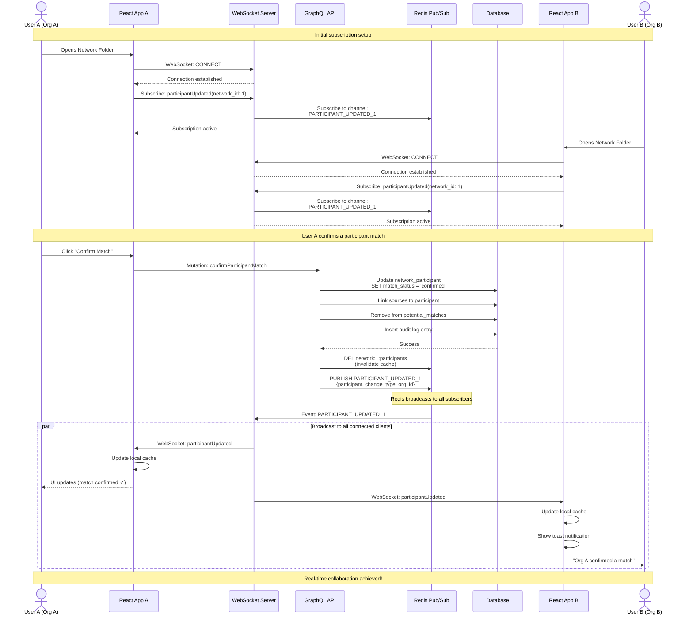
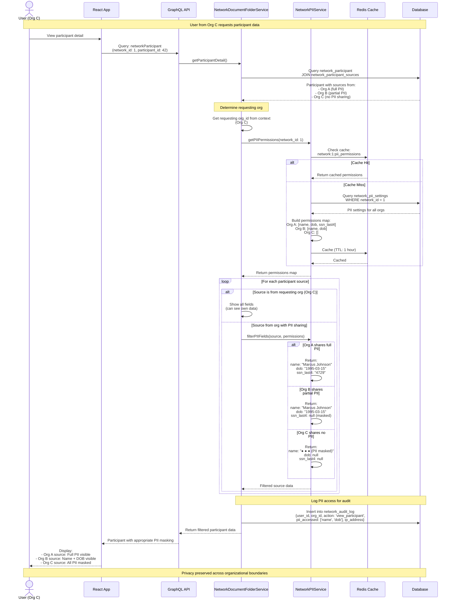
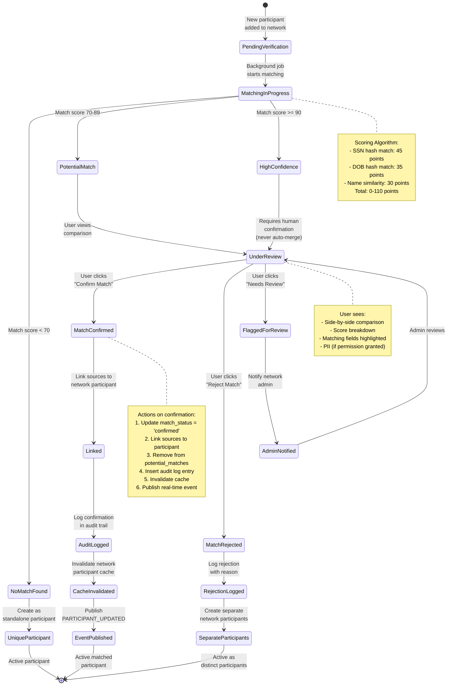
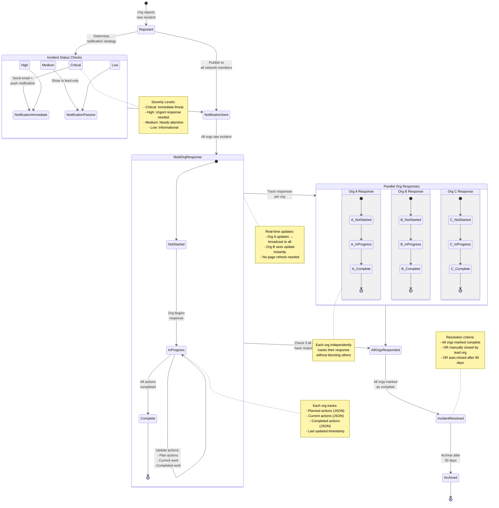

# Network Document Folder - Technical Diagrams

This document contains all technical diagrams for the Network Document Folder feature. All diagrams are also available as standalone Mermaid source files in the `diagrams/` directory.

**View these diagrams on GitHub** - they render automatically! Or open in VS Code with the Mermaid Preview extension.

---

## Table of Contents

1. [System Architecture](#1-system-architecture)
2. [Database ER Diagram](#2-database-er-diagram)
3. [Sequence Diagrams](#3-sequence-diagrams)
   - [3a. Participant Matching Flow](#3a-participant-matching-flow)
   - [3b. Real-Time Update Flow](#3b-real-time-update-flow)
   - [3c. PII Filtering Flow](#3c-pii-filtering-flow)
4. [Component Hierarchy](#4-component-hierarchy)
5. [State Machine Diagrams](#5-state-machine-diagrams)
   - [5a. Participant Match States](#5a-participant-match-states)
   - [5b. Incident Response Workflow](#5b-incident-response-workflow)

---

## 1. System Architecture

**Purpose**: Complete system overview showing all layers and components

**Shows**: Client layer (React), API layer (GraphQL + WebSocket), Application services, Data layer (network DB + tenant DBs), Infrastructure (Redis, Bull Queue)

**Source**: [`diagrams/01-system-architecture.mmd`](diagrams/01-system-architecture.mmd)



**Key Insights**:
- WebSocket server shares same port as HTTP (Apollo Server)
- Redis serves dual purpose: cache + pub/sub for real-time
- DSF views queried from multiple tenant databases in parallel
- Background jobs handle heavy matching operations

---

## 2. Database ER Diagram

**Purpose**: Entity-relationship diagram of all network-level tables

**Shows**: 10 network tables with all fields, relationships, foreign keys, primary keys

**Source**: [`diagrams/02-database-er-diagram.mmd`](diagrams/02-database-er-diagram.mmd)



**Key Design Decisions**:
- **Separation of concerns**: Network-level data (matches, incidents) separate from tenant data (DSF views)
- **PII security**: Encrypted fields for display, hashed fields for matching
- **Audit trail**: Complete logging of all PII access for compliance
- **Flexibility**: JSON fields for dynamic action tracking and custom tags

---

## 3. Sequence Diagrams

### 3a. Participant Matching Flow

**Purpose**: Step-by-step flow of how participants are matched

**Shows**: User requests → cache check → DSF queries → background matching → score calculation → real-time notification

**Source**: [`diagrams/03a-participant-matching-flow.mmd`](diagrams/03a-participant-matching-flow.mmd)



**Performance Optimizations**:
- Cache hit avoids expensive DSF queries (5-min TTL)
- Parallel DSF view queries across all orgs
- Background job prevents blocking user request
- PII filtering applied before caching

---

### 3b. Real-Time Update Flow

**Purpose**: How updates propagate to all connected clients via WebSocket subscriptions

**Shows**: WebSocket setup → user action → database update → Redis broadcast → all clients receive update

**Source**: [`diagrams/03b-realtime-update-flow.mmd`](diagrams/03b-realtime-update-flow.mmd)



**Why Redis Pub/Sub?**
- Enables horizontal scaling (multiple API servers)
- Broadcasts to all subscribers instantly
- Decoupled from WebSocket server
- Reliable message delivery

---

### 3c. PII Filtering Flow

**Purpose**: How PII is filtered based on org permissions

**Shows**: Permission check → cache lookup → field-level filtering → audit logging

**Source**: [`diagrams/03c-pii-filtering-flow.mmd`](diagrams/03c-pii-filtering-flow.mmd)



**Privacy Guarantees**:
- Never expose PII to unauthorized orgs
- Users can always see their own org's data
- All PII access logged for audit trail
- Permissions cached (1-hour TTL) for performance
- Field-level granularity (not all-or-nothing)

---

## 4. Component Hierarchy

**Purpose**: Complete frontend and backend component structure

**Shows**: React component tree (views → organisms → molecules → atoms), backend services, dependencies

**Source**: [`diagrams/04-component-hierarchy.mmd`](diagrams/04-component-hierarchy.mmd)

```mermaid
graph TB
    subgraph "Frontend Components (React)"
        App["App Shell<br/>(Routing)"]

        subgraph "Views (Pages)"
            Dashboard["Dashboard View<br/>- Network overview<br/>- Activity feed<br/>- Quick stats"]
            People["People View<br/>- Participant list<br/>- Match review"]
            Incidents["Incidents View<br/>- Incident list<br/>- Org responses"]
            Referrals["Referrals View<br/>- Referral tracking"]
            Notes["Notes View<br/>- Collaboration notes"]
        end

        subgraph "Organisms (Complex Components)"
            Header["Network Header<br/>- Network selector<br/>- Connection status<br/>- User menu"]
            ParticipantList["Participant List<br/>- Virtual scrolling<br/>- Filters<br/>- Search"]
            MatchReviewModal["Match Review Modal<br/>- Side-by-side comparison<br/>- Score breakdown<br/>- Confirm/Reject actions"]
            IncidentTimeline["Incident Timeline<br/>- Event history<br/>- Multi-org responses"]
            OrgResponseTracker["Org Response Tracker<br/>- Status per org<br/>- Action tracking"]
        end

        subgraph "Molecules (Composite Components)"
            ParticipantCard["Participant Card<br/>- Avatar<br/>- Name + PII<br/>- Match status"]
            IncidentCard["Incident Card<br/>- Severity badge<br/>- Participants<br/>- Org count"]
            FilterBar["Filter Bar<br/>- Multiple filters<br/>- Clear all"]
            SearchInput["Search Input<br/>- Debounced<br/>- Clear button"]
        end

        subgraph "Atoms (Basic Components)"
            Button["Button<br/>- Variants<br/>- Sizes<br/>- Icons"]
            Badge["Badge<br/>- Status colors<br/>- Severity levels"]
            StatusDot["Status Dot<br/>- Connected/syncing"]
            PIIToggle["PII Toggle<br/>- Show/hide switch"]
        end

        subgraph "Hooks (State & Logic)"
            useParticipants["useNetworkParticipants<br/>- Fetch + cache<br/>- Real-time updates"]
            useSubscription["useParticipantSubscription<br/>- WebSocket connection<br/>- Event handling"]
            usePII["usePIIPermissions<br/>- Check visibility<br/>- Filter fields"]
            useConnection["useConnectionStatus<br/>- Monitor WS<br/>- Reconnect logic"]
        end

        subgraph "GraphQL (Relay)"
            Queries["Queries<br/>- NetworkParticipantsQuery<br/>- NetworkIncidentsQuery<br/>- PotentialMatchesQuery"]
            Mutations["Mutations<br/>- ConfirmMatchMutation<br/>- CreateIncidentMutation<br/>- UpdateResponseMutation"]
            Subscriptions["Subscriptions<br/>- ParticipantUpdatedSub<br/>- IncidentUpdatedSub<br/>- MatchDetectedSub"]
        end
    end

    subgraph "Backend Services (Node.js)"
        subgraph "GraphQL Layer"
            ApolloServer["Apollo Server<br/>- HTTP endpoint<br/>- WebSocket endpoint"]
            TypeDefs["Type Definitions<br/>- Schema<br/>- Enums<br/>- Interfaces"]
            Resolvers["Resolvers<br/>- Queries<br/>- Mutations<br/>- Subscriptions"]
        end

        subgraph "Application Services"
            NDFService["NetworkDocumentFolderService<br/>- Orchestration<br/>- DSF enrichment<br/>- Cache management"]
            MatchService["ParticipantMatchingService<br/>- Scoring algorithm<br/>- Hash generation<br/>- Match detection"]
            PIIService["NetworkPIIService<br/>- Permission checks<br/>- Field filtering<br/>- Audit logging"]
            CacheService["NetworkCacheService<br/>- Multi-tier cache<br/>- Invalidation<br/>- TTL management"]
            EventService["NetworkEventService<br/>- Redis Pub/Sub<br/>- Event broadcasting"]
        end

        subgraph "Repository Layer"
            Models["Sequelize Models<br/>- NetworkParticipant<br/>- NetworkIncident<br/>- NetworkReferral<br/>- etc."]
            Queries["Repository Queries<br/>- Raw SQL<br/>- DSF view queries<br/>- Cross-tenant joins"]
        end

        subgraph "Infrastructure"
            Redis["Redis Client<br/>- Cache operations<br/>- Pub/Sub channels"]
            BullQueue["Bull Queue<br/>- Background jobs<br/>- Matching worker"]
        end
    end

    %% Frontend relationships
    App --> Dashboard
    App --> People
    App --> Incidents
    App --> Referrals
    App --> Notes

    Dashboard --> Header
    People --> Header
    People --> ParticipantList
    People --> MatchReviewModal

    Incidents --> IncidentTimeline
    Incidents --> OrgResponseTracker

    ParticipantList --> ParticipantCard
    ParticipantList --> FilterBar
    ParticipantList --> SearchInput

    MatchReviewModal --> ParticipantCard
    MatchReviewModal --> Button
    MatchReviewModal --> Badge

    FilterBar --> Button
    SearchInput --> Button

    ParticipantCard --> Badge
    ParticipantCard --> StatusDot
    ParticipantCard --> PIIToggle

    %% Frontend hooks
    People --> useParticipants
    People --> useSubscription
    ParticipantCard --> usePII
    Header --> useConnection

    %% Frontend GraphQL
    useParticipants --> Queries
    MatchReviewModal --> Mutations
    useSubscription --> Subscriptions

    %% Backend relationships
    Queries --> ApolloServer
    Mutations --> ApolloServer
    Subscriptions --> ApolloServer

    ApolloServer --> TypeDefs
    ApolloServer --> Resolvers

    Resolvers --> NDFService
    Resolvers --> MatchService
    Resolvers --> PIIService

    NDFService --> MatchService
    NDFService --> PIIService
    NDFService --> CacheService
    NDFService --> EventService

    NDFService --> Models
    NDFService --> Queries

    MatchService --> Models
    PIIService --> Models

    CacheService --> Redis
    EventService --> Redis
    MatchService --> BullQueue

    %% Styling
    classDef frontend fill:#e1f5ff,stroke:#01579b,stroke-width:2px
    classDef backend fill:#fff3e0,stroke:#e65100,stroke-width:2px
    classDef service fill:#f3e5f5,stroke:#4a148c,stroke-width:2px
    classDef infra fill:#fce4ec,stroke:#880e4f,stroke-width:2px

    class App,Dashboard,People,Incidents,Referrals,Notes,Header,ParticipantList,MatchReviewModal,IncidentTimeline,OrgResponseTracker,ParticipantCard,IncidentCard,FilterBar,SearchInput,Button,Badge,StatusDot,PIIToggle,useParticipants,useSubscription,usePII,useConnection,Queries,Mutations,Subscriptions frontend

    class ApolloServer,TypeDefs,Resolvers backend

    class NDFService,MatchService,PIIService,CacheService,EventService,Models,Queries service

    class Redis,BullQueue infra
```



**Architectural Patterns**:
- **Atomic Design**: Components organized by complexity (atoms → molecules → organisms → templates → pages)
- **Custom Hooks**: Encapsulate state management and side effects
- **Relay**: GraphQL client with built-in caching and normalization
- **Service Layer**: Business logic separated from data access
- **Repository Pattern**: SQL queries isolated from business logic

---

## 5. State Machine Diagrams

### 5a. Participant Match States

**Purpose**: State machine for participant matching lifecycle

**Shows**: New participant → matching → verification → confirmation (all possible states and transitions)

**Source**: [`diagrams/05a-participant-match-states.mmd`](diagrams/05a-participant-match-states.mmd)



**Critical Design Decision**: Even matches with 95+ score require human confirmation. This prevents false positives which are worse than missed matches.

---

### 5b. Incident Response Workflow

**Purpose**: Multi-org incident response tracking

**Shows**: Incident reported → notification → parallel org responses → resolution

**Source**: [`diagrams/05b-incident-response-workflow.mmd`](diagrams/05b-incident-response-workflow.mmd)



**Multi-Org Coordination**: Each organization tracks their own response independently without blocking others. Real-time updates keep everyone synchronized.

---

## Color Coding Legend

All diagrams use consistent color coding:

- 🔵 **Blue** (`#e1f5ff`): Client/Frontend components
- 🟠 **Orange** (`#fff3e0`): API layer (GraphQL HTTP/WebSocket)
- 🟣 **Purple** (`#f3e5f5`): Application services (business logic)
- 🟢 **Green** (`#e8f5e9`): Data layer (databases, models)
- 🔴 **Pink** (`#fce4ec`): Infrastructure (Redis, queues)

---

## Viewing Options

### Option 1: GitHub (Easiest)
Just view this file on GitHub - diagrams render automatically!

### Option 2: VS Code
1. Install **Mermaid Preview** extension
2. Open this file or any `.mmd` file
3. Right-click → "Open Preview"

### Option 3: Mermaid Live Editor
1. Go to https://mermaid.live/
2. Copy/paste diagram code
3. Export as PNG/SVG

### Option 4: Export to Images
```bash
# Install mermaid-cli
npm install -g @mermaid-js/mermaid-cli

# Export all diagrams
cd diagrams/
for file in *.mmd; do
  mmdc -i "$file" -o "exports/${file%.mmd}.png" -b transparent
done
```

---

## Source Files

All diagrams are also available as standalone Mermaid files in [`diagrams/`](diagrams/):

- `01-system-architecture.mmd`
- `02-database-er-diagram.mmd`
- `03a-participant-matching-flow.mmd`
- `03b-realtime-update-flow.mmd`
- `03c-pii-filtering-flow.mmd`
- `04-component-hierarchy.mmd`
- `05a-participant-match-states.mmd`
- `05b-incident-response-workflow.mmd`

---

**Created**: March 26, 2025
**Last Updated**: March 26, 2025
**Maintainer**: Development Team

For questions about these diagrams, see:
- [`README.md`](../README.md) - Project overview
- [`ARCHITECTURE.md`](ARCHITECTURE.md) - Detailed architecture documentation
- [`IMPLEMENTATION_SUMMARY.md`](../IMPLEMENTATION_SUMMARY.md) - Implementation plan
